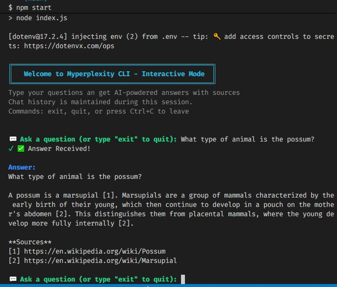

# MyPerplexity CLI

An AI-powered interactive command-line interface that answers questions by combining real-time web search with advanced AI reasoning. Built with [Genkit](https://genkit.dev/) and [Tavily](https://tavily.com/) APIs.

> **Learning Project**: Developed as part of [Big School's Master de desarrollo con IA](https://thebigschool.com/master-desarrollo-con-ia/) program.

## Features

- 🔍 **Real-time Web Search**: Uses Tavily API to search current information from the web
- 🤖 **AI-Powered Responses**: Leverages Google's Gemini AI to synthesize search results into comprehensive answers
- 💬 **Interactive CLI**: User-friendly command-line interface with spinners and colored output
- 📚 **Source Citations**: Automatically includes URLs and sources in responses
- 💾 **Chat History**: Maintains conversation history during the session


## Prerequisites

- Node.js v18+
- API Keys:
  - [Google API Key](https://aistudio.google.com/app/apikey) for Gemini AI
  - [Tavily API Key](https://tavily.com/) for web search

## Installation

1. **Clone the repository**
   ```bash
   git clone <repository-url>
   cd 09-master-ia-cli-genkit
   ```

2. **Install dependencies**
   ```bash
   npm install
   ```

3. **Set up environment variables**
   ```bash
   cp .env.example .env
   ```
   
   Then edit `.env` and add your API keys:
   ```
   TAVILY_API_KEY=your_tavily_key_here
   GOOGLE_API_KEY=your_google_api_key_here
   ```

## Usage

### Interactive Mode (CLI)
```bash
npm start
```

This launches the interactive CLI where you can ask questions:
```
💬 Ask a question (or type "exit" to quit): What is the capital of France?

🧁 Thinking...
✅ Answer Received!

Answer:
The capital of France is Paris. Paris is the largest city in France and serves as the 
political, cultural, and economic center of the country...

Sources:
[1] https://example.com/france-capital
[2] https://example.com/paris-info
```

### Development Mode (Genkit UI)
```bash
npm run dev
```

This also runs the interactive CLI **and** starts the Genkit Developer UI on `http://localhost:4000` for development and debugging.


**To access the UI:**
1. Click on the `http://localhost:4000` link in the terminal, or
2. Open your browser and navigate to `http://localhost:4000`

The Genkit UI allows you to:
- Test flows and prompts interactively
- View execution traces and AI model interactions
- Debug tool calls and API responses
- Monitor performance metrics


## Screenshot



*Interactive CLI in action - Ask questions and get AI-powered answers with web sources*


## Project Structure

```
09-master-ia-cli-genkit/
├── index.js              # Main entry point - CLI setup and interaction loop
├── src/
│   ├── agent.js         # Chat agent with search tool configuration
│   └── search.js        # Tavily web search wrapper
├── .env.example         # Environment variables template
└── README.md            # This file
```

## How It Works

1. **User Input**: User enters a question in the CLI
2. **Search**: The chat agent uses Tavily's `searchWeb` tool to find current information
3. **AI Processing**: Google Gemini AI synthesizes search results with its knowledge
4. **Response**: A comprehensive answer is formatted with citations and sources
5. **History**: The exchange is stored in the chat session history

### Architecture

- **index.js**: Manages the CLI interface using Node.js `readline` module
- **agent.js**: Defines the Genkit agent with the search tool and AI prompt
- **search.js**: Wraps the Tavily API with proper configuration options

## Tech Stack

| Technology | Purpose |
|-----------|---------|
| [Genkit](https://genkit.dev/) | AI framework for building agentic apps |
| [Google Gemini AI](https://ai.google.dev/) | Language model for reasoning |
| [Tavily API](https://tavily.com/) | Real-time web search |
| [Zod](https://zod.dev/) | TypeScript-first schema validation |
| [Chalk](https://github.com/chalk/chalk) | Terminal string styling |
| [Ora](https://github.com/sindresorhus/ora) | Elegant terminal spinners |
| [dotenv](https://github.com/motdotla/dotenv) | Environment variable management |
| [Readline](https://nodejs.org/api/readline.html) | CLI input/output (Node.js built-in) |

## References

### Framework & AI APIs
- [Genkit Documentation](https://genkit.dev/docs/get-started/)
  - [Chat & Streaming](https://genkit.dev/docs/chat/)
  - [Tool Calling](https://genkit.dev/docs/tool-calling/)
- [Google AI Studio](https://aistudio.google.com/app/apikey)
- [Tavily API](https://www.tavily.com/about)

### Dependencies
- [@tavily/core](https://www.npmjs.com/package/@tavily/core) - Tavily web search client
- [Chalk](https://www.npmjs.com/package/chalk) - Terminal styling
- [Ora](https://www.npmjs.com/package/ora) - Progress spinners
- [dotenv](https://www.npmjs.com/package/dotenv) - Environment variables
- [Zod](https://www.npmjs.com/package/zod) - Schema validation

### Node.js APIs
- [Readline Module](https://nodejs.org/api/readline.html) - Interactive CLI

## Learning Project

This project was developed as part of the [**Master de Desarrollo con IA**](https://thebigschool.com/master-desarrollo-con-ia/) by [Big School](https://thebigschool.com/), a comprehensive program covering AI development with modern tools and frameworks.

**Completion Date**: February 9, 2026
